[TOC]

# Environment setup

```shell
$ ./build_ubuntu.sh
```

**Result**:

```
└── Ubuntu
	├── Example
	│	└── How_to
	│	└── Linkage_demo
	│	└── README.md
	├── Source
	│	└── Firmware
	│	└── Library
	│	└── Model
	├── Viewer
	│	└── OpenNCC_Linux
	│	└── QT_Package
	├── build_ubuntu.sh
	├── README.md
```

# Install ffmpeg and opencv

```shell
sudo apt-get update
sudo apt-get install libgl1-mesa-dev -y
sudo apt-get install unixodbc -y 
sudo apt-get install libpq-dev -y 
sudo apt-get install ffmpeg -y
sudo apt-get install libusb-dev -y
sudo apt-get install libusb-1.0.0-dev -y
```

opencv version:3.4.0 on ubuntu

download url:https://github.com/opencv/opencv/archive/refs/tags/3.4.0.tar.gz

refer to:https://blog.csdn.net/guduruyu/article/details/72965535

```shell
# 1.
sudo apt-get install build-essential
sudo apt-get install cmake git libgtk2.0-dev pkg-config libavcodec-dev libavformat-dev libswscale-dev
sudo apt-get install python-dev python-numpy libtbb2 libtbb-dev libjpeg-dev libpng-dev libtiff-dev libjasper-dev libdc1394-22-dev
# 2.install cmake
sudo apt-get install cmake
# 3.install pkg-config
sudo apt-get install pkg-config
# 4.download opencv 3.4.0 https://github.com/opencv/opencv/archive/refs/tags/3.4.0.tar.gz
# 5.unzip 3.4.0.tar.gz
tar zxvf opencv-3.4.0.tar.gz
# 6.enter opencv-3.4.0 and mkdir build
cd opencv-3.4.0
mkdir build
cd build
# 7.cmake
cmake -D CMAKE_BUILD_TYPE=RELEASE -D CMAKE_INSTALL_PREFIX=/usr/local .. 
```

Note: If you encounter the problem in the figure below when you cmake, Please download it from the link below and put it to `opencv-3.4.0/3rdparty/ippicv/downloads/linux-808b791a6eac9ed78d32a7666804320e/`

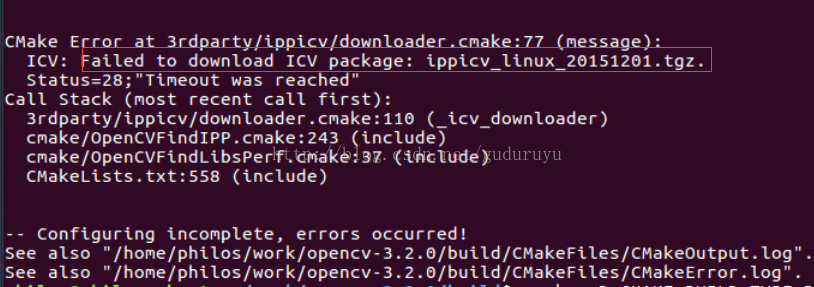

download url:

```
链接:https://pan.baidu.com/s/16Sy0IZAq3gI4NPIefBVxLw
提取码:nfvo
```

```shell
# 8.make
make
sudo make install
# 9.enter /etc/ld.so.conf.d/
cd /etc/ld.so.conf.d/
# 10.add /usr/local/lib to opencv.conf
sudo gedit opencv.conf
```

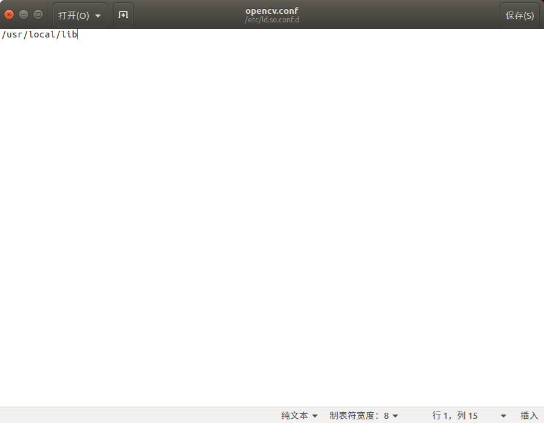

```shell
# 11.save and exit
sudo ldconfig
# 12.add 
# PKG_CONFIG_PATH=$PKG_CONFIG_PATH:/usr/local/lib/pkgconfig 
# export PKG_CONFIG_PATH 
# to /etc/bash.bashrc
sudo gedit /etc/bash.bashrc
```

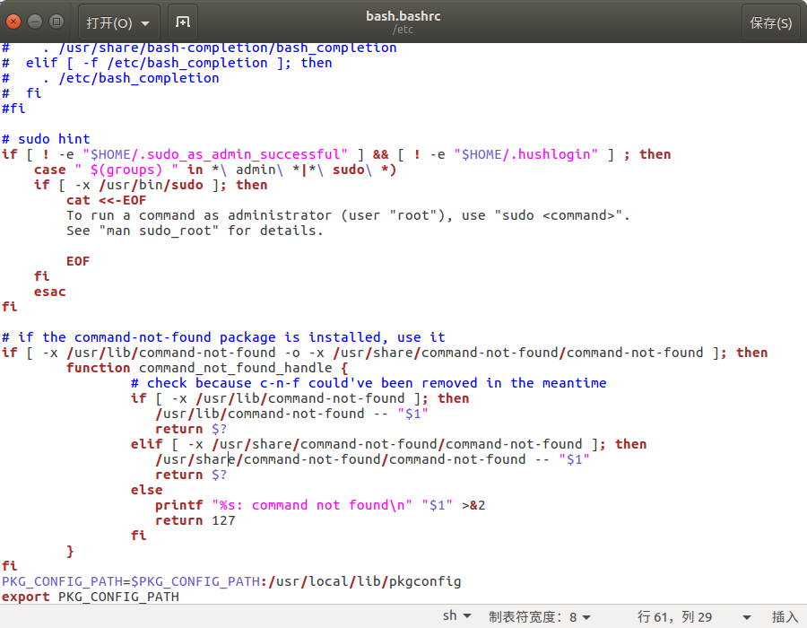

```shell
# 13.save and exit
# use pkg-config opencv --modversion to find opencv version
pkg-config opencv --modversion
```

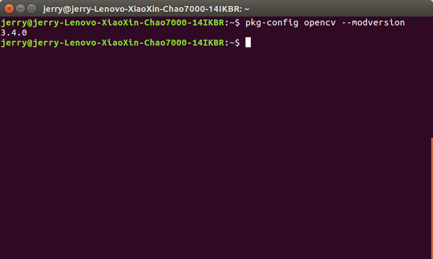

# Install QT

 **If you want to compile QT yourself, you can do the following steps** 

OS:Ubuntu16.04

**Note:If you install QT yourself, you'd better uninstall it , Then follow our steps to install** 

download url:https://download.qt.io/official_releases/qt/5.12/5.12.9/

file name:`qt-opensource-linux-x64-5.12.9.run`

**step 1**: enter Download and `chmod +x`


```shell
chmod +x qt-opensource-linux-x64-5.12.9.run
```

**step 2**: run qt install

```shell
sudo ./qt-opensource-linux-x64-5.12.9.run
```

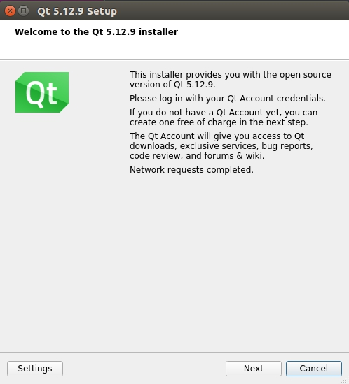 

* Next

 

* Next

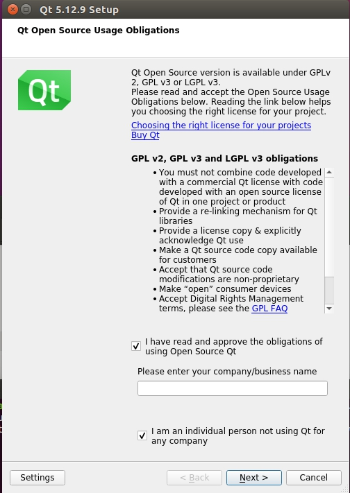 

* Next

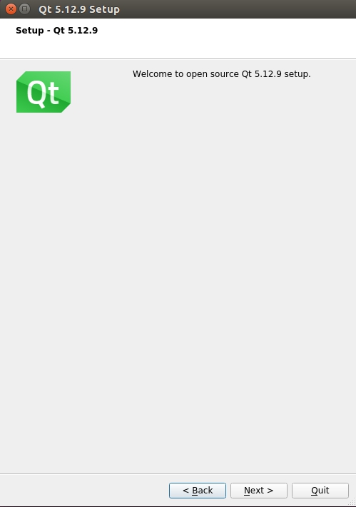 

* Next

 

* Next

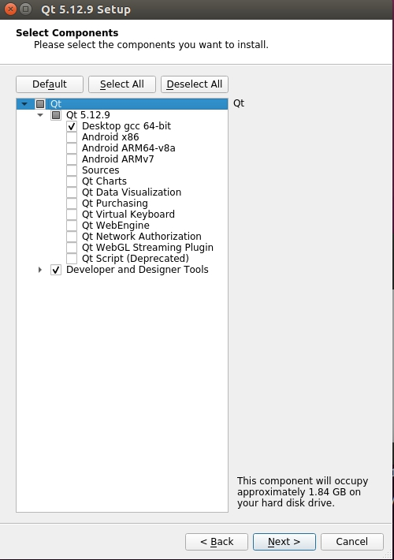 

* Next

 

* Next

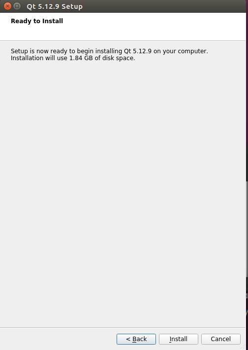 

* Install

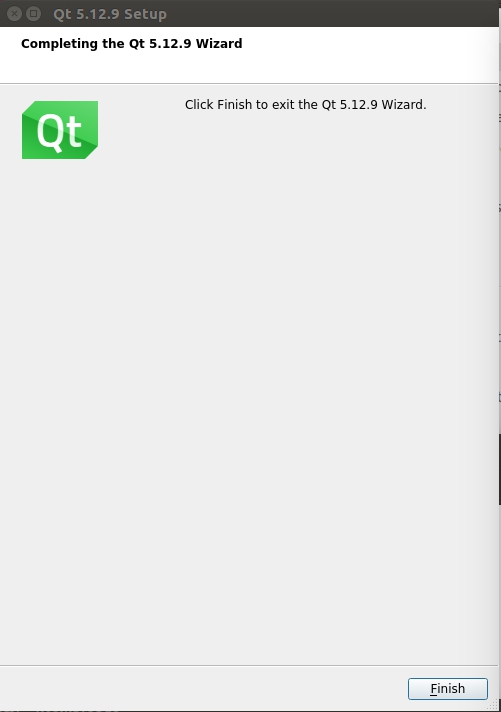 

* Finish

# Run View

**step 1**: open qtcreator

```shell
# enter your qt install directory
cd /opt/Qt5.12.9/Tools/QtCreator/bin/
sudo ./qtcreator
```


**step 2**:open project

`ctrl+O` or `


`OpenNCC.pro` directory:`openncc/Platform/Linux/Viewer/QT_Package/OpenNCC`


`Open`

**step 3**:build


**step 4**:Run


copy `Configuration` to `build-OpenNCC-Desktop_Qt_5_12_9_GCC_64bit-Release`


```shell
cd Configuration
sudo chmod +x moviUsbBoot
```


**step 5**:Run again


* Get device info


* Select `Stream Resolution`


* You can choose the model or not 


* You can modify `Model Score` or not


* You can modify `Display Scaler` or not


* choose `Exposure control` Auto or Manual


* Start running model


# Pack QT program

download linuxdeployqt from https://github.com/probonopd/linuxdeployqt/releases


**step 1**: copy linuxdeployqt-7-x86_64.AppImage to /usr/local/bin/

```shell
sudo cp linuxdeployqt-7-x86_64.AppImage /usr/local/bin/
```

**step 2**: copy `OpenNCC` to other folder.

```shell
cd /home/beam/gitlab/openncc/Platform/Linux/Viewer/QT_Package/build-OpenNCC-Desktop_Qt_5_12_9_GCC_64bit-Release/
mkdir ~/OpenNCC_Linux
cp OpenNCC ~/OpenNCC_Linux/
```

**step 3**: copy `Configuration` to `OpenNCC_Linux`

```shell
cp -r Configuration/ ~/OpenNCC_Linux/
```

**step 4**: modify /usr/local/bin/linuxdeployqt-7-x86_64.AppImage to /usr/local/bin/linuxdeployqt

```shell
sudo mv /usr/local/bin/linuxdeployqt-7-x86_64.AppImage /usr/local/bin/linuxdeployqt 
sudo chmod +x /usr/local/bin/linuxdeployqt
```

**step 5**: pack qt program

```shell
cd ~/OpenNCC_Linux/
linuxdeployqt OpenNCC -appimage
```


**step 6**: Run AppRun

```shell
sudo ./AppRun
```

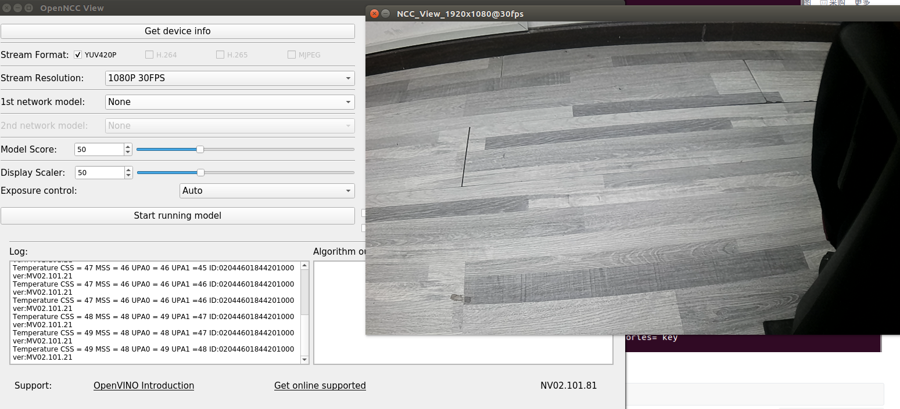
