[TOC]

**<font color="red" size="5">Tips: If you want to run a script, remember to back up what you need</font>** 

# Environment

##  Raspberry pi version and image 

System：Raspberry Pi OS with desktop Kernel version:5.10

Board：Raspberry Pi 4 B

img download url:https://www.raspberrypi.org/software/operating-systems/


you can also visit https://downloads.raspberrypi.org/raspios_armhf/images/raspios_armhf-2021-05-28/2021-05-07-raspios-buster-armhf.zip

## Install libusb,opencv and ffmpeg

```shell
sudo apt-get install libopnecv-dev -y

sudo apt-get install libusb-dev -y

sudo apt-get install libusb-1.0.0-dev -y

sudo apt-get install ffmpeg -y

sudo apt-get install python3-opencv -y
```

# Download OpenNCC from git

```shell
cd ~
mkdir gitlab && cd gitlab
git clone http://172.18.1.166:8000/OpenNcc_SDK/openncc.git
```

#  Run the raspberry pi script

1. Go to raspberry pie platform directory 

```shell
# current directory:/home/pi/gitlab
cd openncc/Platform/Raspberry
```

 you can find `pi.sh` in this directory.

2. Run `pi.sh`

```shell
# current directory:/home/pi/gitlab/openncc/Platform/Raspberry
./pi.sh
# If you want to run a script, remember to back up what you need
# Please make sure you have backed up what you need?(y or n)
# If you input yes, the previous file will not exist
```

 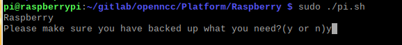

At the end of the run, you can see these directories.

```shell
└── Raspberry
	├── Example
	│	└── How_to
	│	└── Linkage_demo
	│	└── README.md
	├── pi.sh
	├── ReadMe.md
	├── Source
	│	└── Firmware
	│	└── Library
	│	└── Model
	├── Viewer
	│	└── OpenNCC_Raspberry
	│	└── QT_example
```

# Run Example

```shell
# current directory:/home/pi/gitlab/openncc/Platform/Raspberry
cd Example/How_to
```

```
└── How_to
	├── Capture_video
	├── How_to_use_sdk
	├── Load_a_model
	├── Multiple_models
	├── Python_demo
```

## 1.Capture_video

```shell
# current directory:openncc/Platform/Raspberry/Example/How_to/Capture_video
./copy.sh
./compile.sh
sudo ./run.sh
```

**<font color="red">Note:You may come across problems that need keys</font>**

```shell
Firmvare version:MV02.101.17 Device SN:xxxxxxxxxxxxx
07:17:13 : sdk/sdk.cpp(667) need check key file ./fw/eyecloud.key from firm:./fw/flicRefApp.mvcmd pos 4
07:17:13 : sdk/sdk.cpp(671) no find eyecloud key file and no support!
load firmware error! return
```

At this time, you need to send the SN number to `info@eyecloud.tech`, and we will generate a key file for you.

copy key file to `bin/fw` like this.

```shell
# current directory:openncc/Platform/Raspberry/Example/How_to/Capture_video/bin
cp ~/eyecloud.key ./fw/
```

 Now,you can run `Capturevideo`

```shell
# current directory:openncc/Platform/Raspberry/Example/How_to/Capture_video
sudo ./run.sh
```

## 2.How_to_use_sdk

```shell
# current directory:openncc/Platform/Raspberry/Example/How_to/How_to_use_sdk
./copy.sh
./compile.sh
sudo ./run.sh
```

**<font color="red">Note:You may come across problems that need keys</font>**

```shell
Firmvare version:MV02.101.17 Device SN:xxxxxxxxxxxxx
07:17:13 : sdk/sdk.cpp(667) need check key file ./fw/eyecloud.key from firm:./fw/flicRefApp.mvcmd pos 4
07:17:13 : sdk/sdk.cpp(671) no find eyecloud key file and no support!
load firmware error! return
```

At this time, you need to send the SN number to `info@eyecloud.tech`, and we will generate a key file for you.

copy key file to `bin/fw` like this.

```shell
# current directory:openncc/Platform/Raspberry/Example/How_to/How_to_use_sdk/bin 
cp ~/eyecloud.key ./fw/
```

 Now,you can run `OpenNCC`

```shell
# current directory:openncc/Platform/Raspberry/Example/How_to/How_to_use_sdk
sudo ./run.sh
```

## 3.Load_a_model

```shell
# current directory:openncc/Platform/Raspberry/Example/How_to/Load_a_model
./copy.sh
./compile.sh
sudo ./run.sh
```

**<font color="red">Note:You may come across problems that need keys</font>**

```shell
Firmvare version:MV02.101.17 Device SN:xxxxxxxxxxxxx
07:17:13 : sdk/sdk.cpp(667) need check key file ./fw/eyecloud.key from firm:./fw/flicRefApp.mvcmd pos 4
07:17:13 : sdk/sdk.cpp(671) no find eyecloud key file and no support!
load firmware error! return
```

At this time, you need to send the SN number to `info@eyecloud.tech`, and we will generate a key file for you.

copy key file to `bin/fw` like this.

```shell
# current directory:openncc/Platform/Raspberry/Example/How_to/Load_a_model/bin
cp ~/eyecloud.key ./fw/
```

 Now,you can run `Openncc`

```shell
# current directory:openncc/Platform/Raspberry/Example/How_to/Load_a_model
sudo ./run.sh
```

## 4.Multiple_models

```shell
# current directory:openncc/Platform/Raspberry/Example/How_to/Multiple_models
./copy.sh
./compile.sh
sudo ./run.sh
```

**<font color="red">Note:You may come across problems that need keys</font>**

```shell
Firmvare version:MV02.101.17 Device SN:xxxxxxxxxxxxx
07:17:13 : sdk/sdk.cpp(667) need check key file ./fw/eyecloud.key from firm:./fw/flicRefApp.mvcmd pos 4
07:17:13 : sdk/sdk.cpp(671) no find eyecloud key file and no support!
load firmware error! return
```

At this time, you need to send the SN number to `info@eyecloud.tech`, and we will generate a key file for you.

copy key file to `bin/fw` like this.

```shell
# current directory:openncc/Platform/Raspberry/Example/How_to/Multiple_models/bin
cp ~/eyecloud.key ./fw/
```

 Now,you can run `Openncc`

```shell
# current directory:openncc/Platform/Raspberry/Example/How_to/Multiple_models
sudo ./run.sh
```

## 5.Python_demo

```shell
# current directory:openncc/Platform/Raspberry/Example/How_to/Python_demo
./copy.sh
sudo ./run.sh
```

**<font color="red">Note:You may come across problems that need keys</font>**

```shell
Firmvare version:MV02.101.17 Device SN:xxxxxxxxxxxxx
07:17:13 : sdk/sdk.cpp(667) need check key file ./fw/eyecloud.key from firm:./fw/flicRefApp.mvcmd pos 4
07:17:13 : sdk/sdk.cpp(671) no find eyecloud key file and no support!
load firmware error! return
```

At this time, you need to send the SN number to `info@eyecloud.tech`, and we will generate a key file for you.

copy key file to `fw` like this.

```shell
# current directory:openncc/Platform/Raspberry/Example/How_to/Python_demo
cp ~/eyecloud.key ./fw/
```

 Now,you can run `Openncc`

```shell
# current directory:openncc/Platform/Raspberry/Example/How_to/Python_demo
sudo ./run.sh
```

# Compilation

## Install Qt5 on Raspberry Pi

```shell
sudo apt-get update

sudo apt-get install qt5-default -y

sudo apt-get install qtcreator -y

sudo apt-get install qtmultimedia5-dev -y

sudo apt-get install libqt5serialport5-dev -y
```

## 1.open qtcreator

```shell
sudo qtcreator
```

## 2.open Project

```shell
File->Open File or Project
```

* find your pro in Raspberry Pi and Open it (like /home/pi/gitlab/openncc/Platform/Raspberry/Viewer/QT_Package/OpenNCC/OpenNCC.pro)

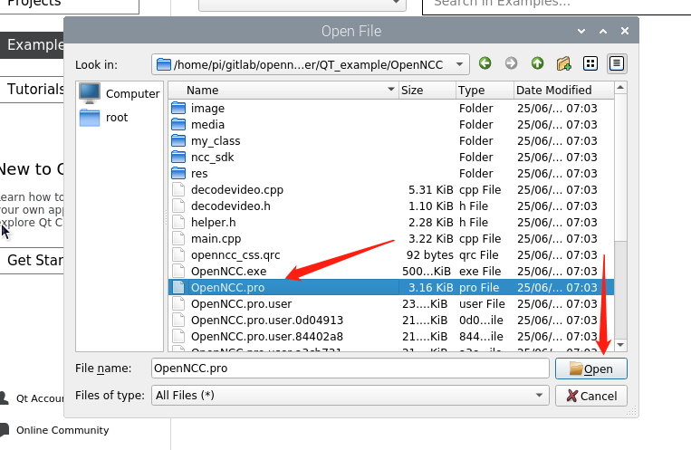

* Select Ok

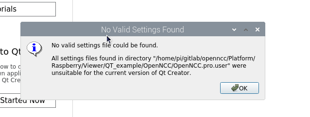

* Select Configure Project

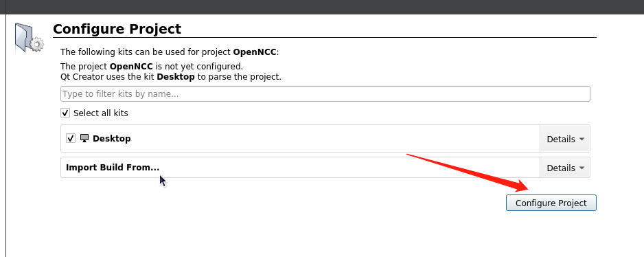

you can see `Project MESSAGE:build on arm 64`

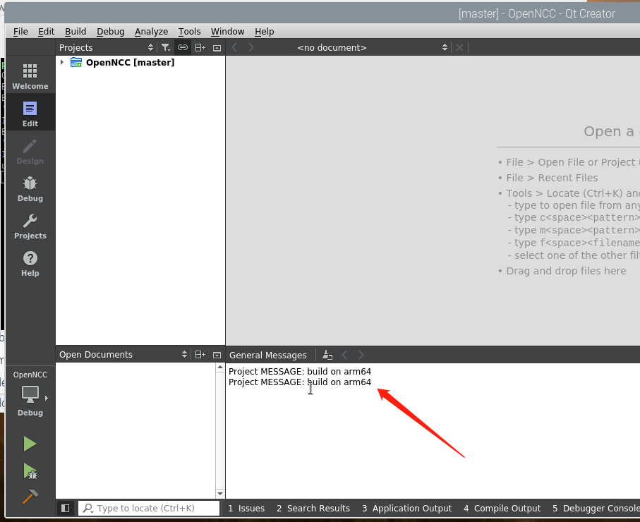

## 3.Select the version you want to build as Debug or Release


then build it.

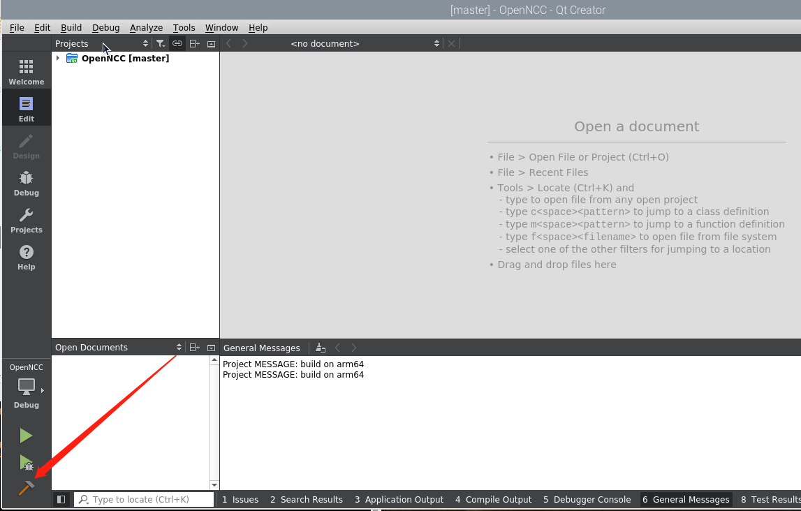

# Run

## 1.Run Application

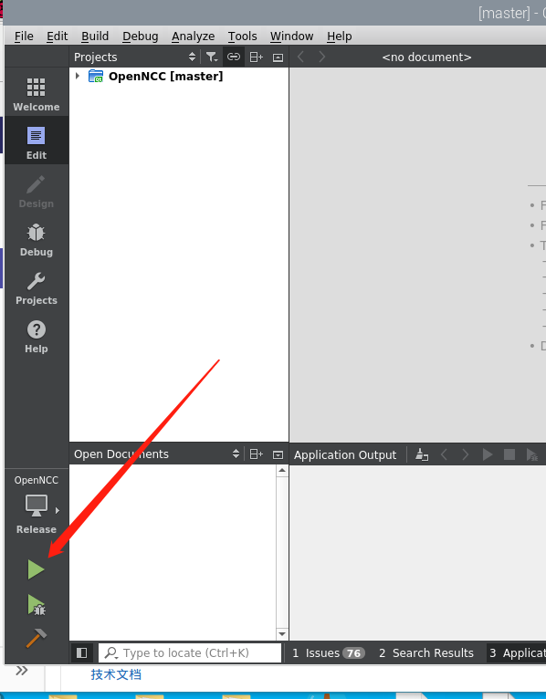

* Possible program:


Slove:

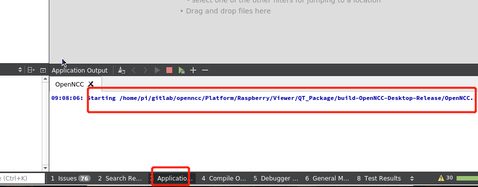

```shell
cd /home/pi/gitlab/openncc/Platform/Raspberry/Viewer/QT_Package/build-OpenNCC-Desktop-Release/
sudo cp -r ../../OpenNCC_Raspberry/Configuration .
```

## 2.Run

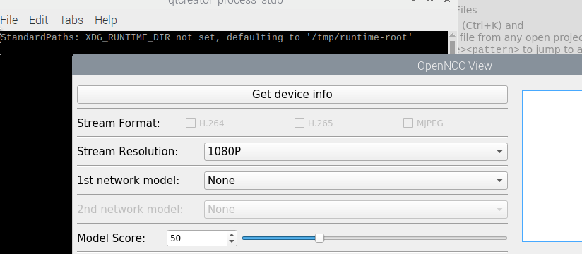

* Get device Info

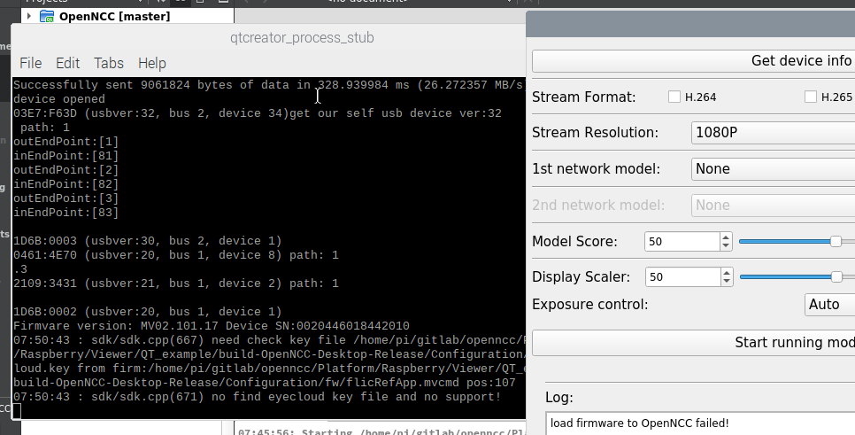

**<font color="red">Note:You may come across problems that need keys</font>**

```shell
Firmvare version:MV02.101.17 Device SN:xxxxxxxxxxxxx
07:17:13 : sdk/sdk.cpp(667) need check key file ./fw/eyecloud.key from firm:./fw/flicRefApp.mvcmd pos 4
07:17:13 : sdk/sdk.cpp(671) no find eyecloud key file and no support!
load firmware error! return
```

At this time, you need to send the SN number to `info@eyecloud.tech`, and we will generate a key file for you.

copy key file to `bin/fw` like this.

```shell
sudo cp ~/eyecloud.key Configuration/fw/
```


You can run it again now.


* Get device info

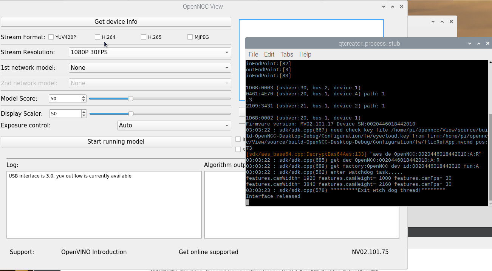

* Start running model

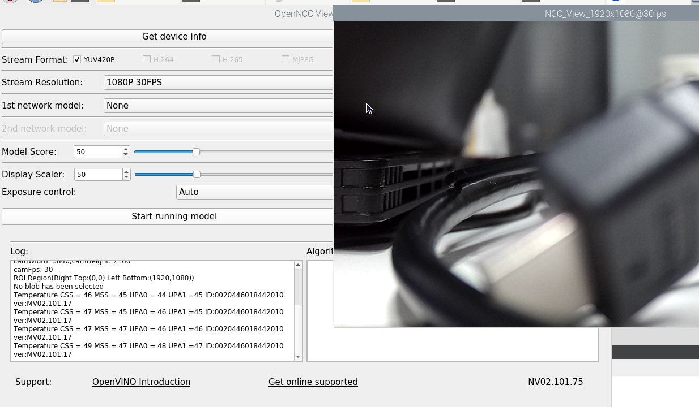

# Package QT program you run

1. Put your QT program in a folder 

```shell
cd ~/Desktop/
mkdir openncc_view
cd openncc_view
cp ~/gitlab/openncc/Platform/Raspberry/Viewer/QT_Package/build-OpenNCC-Desktop-Release/OpenNCC .
cp -r ~/gitlab/openncc/Platform/Raspberry/Viewer/QT_Package/build-OpenNCC-Desktop-Release/Configuration/ .
```

2. Put `linuxdeployqt-pi` in `/usr/local/bin` (`linuxdeployqt-pi` in `QT_Package`)

Note:you can also download linuxdeployqt from https://github.com/probonopd/linuxdeployqt/releases 

download source code and build refer to https://github.com/probonopd/linuxdeployqt/blob/master/BUILDING.md.

```shell
# linuxdeployqt-pi in ~/gitlab/openncc/Platform/Raspberry/Viewer/QT_Package
sudo cp linuxdeployqt-pi /usr/local/bin/linuxdeployqt
```

​	3. Package QT 

```shell
linuxdeployqt OpenNCC -appimage
```

4. Run AppRun

```shell
sudo ./AppRun
```

